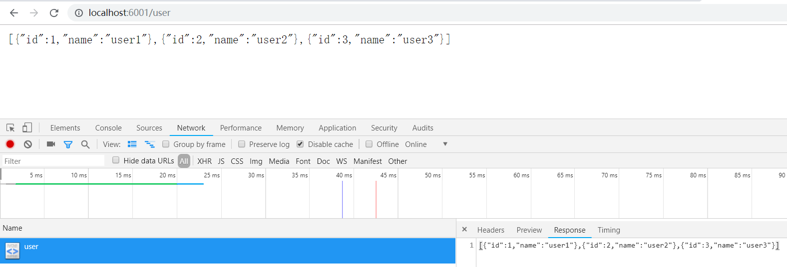

# MVC

MVC（Model-View-Controller）是最常见的软件架构之一

MVC 包含以下三部分：

- Model（模型）：负责保存应用数据，与后端数据进行同步，将新的数据发送到 View，用户得到反馈
- View(视图）： 负责视图展示，将model中的数据可视化出来， 传送指令到 Controller
- Controller（控制）:负责业务逻辑，根据用户行为对Model数据进行修改

特点：

​	所有通信都是单向的


# 基于Koa实现MVC分层架构

egg.js 是基于KOA开发的MVC框架

特点是： 

- 约定大于配置
- 开发效率高
- 可维护性强

egg.js 结构


## 0.项目页面

项目首页：http://localhost:6001/  

项目详情页：http://localhost:6001/detail 

用户首页：http://localhost:6001/user 

用户信息：http://localhost:6001/user/info 

## 1.初始化

```bash
$ mkdir y-eggjs && cd y-eggjs
$ npm init
$ npm i koa koa-router --save
```

## 2.添加项目启动代码

- 创建app.js：应用程序入口文件

  ```js
  const Yegg = require('./yegg');
  const app = new Yegg();
  app.listen(6001);
  ```

- 创建yegg.js： 框架构造器

  ```js
  const Koa = require('koa');
  
  class Yegg {
      constructor(options) {
          this.$app = new Koa(options);
      }
      listen(port) {
          this.$app.listen(port, () => {
              console.log(`server启动， 监听端口为${port}`);
          })
      }
  }
  
  module.exports = Yegg;
  ```

- package.json

  ```json
     "scripts": {
  +    "dev": "nodemon ./app.js",
       "test": "echo \"Error: no test specified\" && exit 1"
     },
  ```

- 启动项目

  ```bash
  $ npm run dev
  [nodemon] starting `node ./app.js`
  server启动， 监听端口为6001
  ```

## 3.处理路由

### 约定

- 所有路由，都要放在**routes**文件夹中
- 若导出路由对象，使用动词+空格+路径作为key，值是操作方法
- 若导出函数，则函数返回第二条约定格式的对象

### 路由定义

创建名字为routes的文件夹， 在routes文件夹中添加两个路由文件：index.js 和 user.js

- 新建./routes/index.js ，默认Index.js没有前缀。

  ```js
  module.exports = {
      "get /": async ctx => {
          ctx.body = "项目首页";
      },
      "get /detail": ctx => {
          ctx.body = "项目详情页";
      }
  }
  ```

- 新建./routes/user.js，路由前缀是/user。

  ```js
  module.exports = {
      "get /": async ctx => {
          ctx.body = "用户首页";
      },
      "get /info": ctx => {
          ctx.body = "用户信息";
      }
  }
  ```

### 注册路由

- 项目初始化时应该注册所有路由， 当发生请求时，做出相应处理。

  ```js
  --- a/yegg.js
  +++ b/yegg.js
  @@ -1,8 +1,10 @@
   const Koa = require('koa');
  -
  +const { initRouter } = require('./loader');
   class Yegg {
       constructor(options) {
           this.$app = new Koa(options);
  +        this.$router = initRouter();
  +        this.$app.use(this.$router.routes());
       }
  ```

- 在注册路由之前，应该先加载路由文件，新建./loader.js，用于加载文件

  - load函数：用于读取指定目录下的文件

  - initRouter函数：用于解析routes目录下的文件， 并注册路由。
  - eg：注册路由"/" :`router.get('/', (ctx) => {ctx.body = "项目首页";});`, 当请求"/"， 页面应显示为“项目首页”。

  ```js
  const path = require('path');
  const fs = require('fs');
  const Router = require('koa-router');
  
  //读取指定目录下文件
  function load(dir, cb) {
      //获取文件夹绝对路径
      const dirPath = path.resolve(__dirname, dir);
      //读取文件夹下文件
      const files = fs.readdirSync(dirPath); //files => [ 'index.js', 'user.js' ]
  
      //遍历文件夹下所有文件
      files.forEach(filename => {
          // 去掉后缀
          filename = filename.replace(".js", ""); //index.js=>index
          // 导入文件
          const file = require(dirPath + "/" + filename);
          // 处理逻辑
          cb(filename, file);
      })
  }
  
  function initRouter() {
      const router = new Router();
      load("routes", (filename, routes) => { //("index", { "get /": async ctx => { ctx.body = "项目首页"; }, "get /detail": ctx => { ctx.body = "项目详情页"; } })
          const prefix = filename === "index" ? "" : `/${filename}`; // "" || "/user"
  
          //解析文件内容，注册路由 eg: router.get('/', async ctx => {ctx.body = "项目首页";});
          Object.keys(routes).forEach(key => { //key=> "get /"
              const [method, routerPath] = key.split(' ');//["get", "/"]
              router[method](prefix + routerPath, routes[key]);
          })
      })
      return router;
  }
  
  module.exports = { initRouter };
  ```

### 测试

- 在浏览器请求http://localhost:6001/ ， 页面显示如下：

  

- 在浏览器请求http://localhost:6001/detail ， 页面显示如下：

  

- 在浏览器请求http://localhost:6001/user ， 页面显示如下：

  

- 在浏览器请求http://localhost:6001/user/info ， 页面显示如下：

  

​	

​		实际项目中router的处理业务逻辑可能比较复杂， 更好的做法是， routes 文件夹下的文件中只定义路由规则， 路由业务逻辑的处理抽取到Controller中。

## 4. 抽取route中业务逻辑至controller

### 约定

- controller文件夹下面存放业务逻辑代码，框架自动加载并集中暴露

### 1）抽取./routes/index.js 文件中业务逻辑

新建controller/home.js：

```js
module.exports = {
    index: async ctx => {
        ctx.body = "项目首页";
    },
    detail: ctx => {
        ctx.body = "项目详情页";
    }
}
```

### 2）修改路由声明

更新 ./routes/index.js为

```js
module.exports = app => ({
    "get /": app.$controllers.home.index,
    "get /detail": app.$controllers.home.detail
});
```

### 3）初始化controller

由于router依赖controller， 所以需要先加载controller 

更新./yegg.js

```js
--- a/yegg.js
+++ b/yegg.js
@@ -1,9 +1,10 @@
 const Koa = require('koa');
-const { initRouter } = require('./loader');
+const { initRouter, initController } = require('./loader');
 class Yegg {
     constructor(options) {
         this.$app = new Koa(options);
-        this.$router = initRouter();
+        this.$controllers = initController();
+        this.$router = initRouter(this);
         this.$app.use(this.$router.routes());
     }
```

### 4）加载controller

在./loader.js中添加initController 用于加载controller

```js
function initController() {
    const controllers = {};
    load("controller", (filename, controller) => { //("home", { index: async ctx => { ctx.body = "项目首页"; }, detail: ctx => { ctx.body = "项目详情页"; } })
        controllers[filename] = controller; //controllers{index}
    })
    return controllers;
}
```

因为有的route文件需要调用应用实例中的$controllers对象，所以initRouter 函数需要把**应用实例**作为参数。

```js
--- a/loader.js
+++ b/loader.js
@@ -20,11 +20,24 @@ function load(dir, cb) {
     })
 }
 
-function initRouter() {
+function initRouter(app) { //因为有的route文件需要调用应用实例中的$controllers对象，所以initRouter 函数需要把应用实例作为参数。
     const router = new Router();
     load("routes", (filename, routes) => { //("index", { "get /": async ctx => { ctx.body = "项目首页"; }, "get /detail": ctx => { ctx.body = "项目详情页"; } })
         const prefix = filename === "index" ? "" : `/${filename}`; // "" || "/user"
-
+        /*
+            routes 的格式有两种：
+            第一种：
+                {
+                    "get /": (ctx) => { ctx.body = "项目首页"; },
+                    "get /detail": (ctx) => { ctx.body = "项目详情页"; }
+                }
+            第二种：
+            app => ({
+                "get /": app.$controllers.home.index,
+                "get /detail": app.$controllers.home.detail
+            });
+        */
+        routes = typeof (routes) === 'function' ? routes(app) : routes;
         //解析文件内容，注册路由 eg: router.get('/', async ctx => {ctx.body = "项目首页";});
         Object.keys(routes).forEach(key => { //key=> "get /"
             const [method, routerPath] = key.split(' ');//["get", "/"]
@@ -34,4 +47,11 @@ function initRouter() {
     return router;
 }
 
-module.exports = { initRouter };
\ No newline at end of file
+function initController() {
+    const controllers = {};
+    load("controller", (filename, controller) => { //("home", { index: async ctx => { ctx.body = "项目首页"; }, detail: ctx => { ctx.body = "项目详情页"; } })
+        controllers[filename] = controller; //controllers{index}
+    })
+    return controllers;
+}
+module.exports = { initRouter, initController };
```

### 测试

修改后，效果与上面相同

## 5. 服务：抽离通用逻辑至service文件夹，利于复用

在实际应用中，Controller 一般不会自己产出数据，也不会包含复杂的逻辑，复杂的过程应抽象为业务逻辑层 Service。

### 1) 新建service/user.js

```js
const delay = (data, tick) => new Promise(resolve => {
    setTimeout(() => {
        resolve(data);
    }, tick);
});

// 可复用的服务 一个同步，一个异步
module.exports = {
    getUserName() {
        return delay('yegg', 1000);
    },
    getUserInfo() {
        return 20;
    }
};
```

### 2) 初始化service

./yegg.js

```js
--- a/yegg.js
+++ b/yegg.js
@@ -1,8 +1,9 @@
 const Koa = require('koa');
-const { initRouter, initController } = require('./loader');
+const { initRouter, initController, initService } = require('./loader');
 class Yegg {
     constructor(options) {
-        this.$app = new Koa(options);
+        this.$app = new Koa(options);
+        this.$services = initService();
         this.$controllers = initController();
         this.$router = initRouter(this);
         this.$app.use(this.$router.routes());
```

### 3) 加载service

添加initService() 用于加载./service/ 目录下的文件。

```js
function initService(app) {
    const services = {};
    load("service", (filename, service) => { //("user", { getUserName() { return delay('yegg', 1000); }, getUserInfo() { return 20; } });
        services[filename] = service(app); //services['user'] = { getUserName() { return delay('yegg', 1000); }, getUserInfo() { return 20; } } }
    })
    return services;
}
```

​	因为路由处理逻辑需要返回相应的结果 ， 所以需要调用  `app.ctx.body`， 那么执行路由逻辑处理代码时，需要把ctx 挂载到Yegg实例上，把Yegg实例作为参数传递到处理函数中。

./loader.js 

```js
--- a/loader.js
+++ b/loader.js
@@ -41,7 +41,11 @@ function initRouter(app) { //因为有的route文件需要调用应用实例中
         //解析文件内容，注册路由 eg: router.get('/', async ctx => {ctx.body = "项目首页";});
         Object.keys(routes).forEach(key => { //key=> "get /"
             const [method, routerPath] = key.split(' ');//["get", "/"]
-            router[method](prefix + routerPath, routes[key]);
+            // router[method](prefix + routerPath, routes[key]);
+            router[method](prefix + routerPath, async ctx => {// 传入ctx
+                app.ctx = ctx;// 把ctx挂载到app
+                await routes[key](app);
+            });
         })
     })
     return router;
@@ -54,4 +58,13 @@ function initController() {
     })
     return controllers;
 }
-module.exports = { initRouter, initController };
\ No newline at end of file
+
+function initService() {
+    const services = {};
+    load("service", (filename, service) => { //("user", { getUserName() { return delay('yegg', 1000); }, getUserInfo() { return 20; } });
+        services[filename] = service; //services['user'] = { getUserName() { return delay('yegg', 1000); }, getUserInfo() { return 20; } } }
+    })
+    return services;
+}
+
+module.exports = { initRouter, initController, initService };
```

### 4) 使用service

更新./routes/user.js

```js
module.exports = {
    "get /": async app => {
        const name = await app.$services.user.getUserName();
        app.ctx.body = "用户名字：" + name;
    },
    "get /info": app => {
        app.ctx.body = "用户年龄：" + app.$services.user.getUserInfo();
    }
};
```

更新./controller/home.js

```js
--- a/controller/home.js
+++ b/controller/home.js
@@ -1,8 +1,9 @@
 module.exports = {
-    index: async ctx => {
-        ctx.body = "项目首页";
+    index: async app => {
+        const name = await app.$services.user.getUserName()
+        app.ctx.body = `${name} 的项目首页`;
     },
-    detail: ctx => {
-        ctx.body = "项目详情页";
+    detail: app => {
+        app.ctx.body = "项目详情页";
     }
 }

```

### 测试

- 在浏览器请求http://localhost:6001/ ， 页面显示如下：

  

- 在浏览器请求http://localhost:6001/user， 页面显示如下：

  

- 在浏览器请求http://localhost:6001/user/info， 页面显示如下：

  

## 5.数据库集成

### 约定

- ./config/index.js中存放项目配置项
- key表示对应配置目标
- ./model/中存放数据模型

### 1） 集成sequelize

```bash
$ npm install sequelize mysql2 --save
```

### 2) 配置sequelize连接配置项

./config/index.js

```js
module.exports = {
    db: {
        dialect: "mysql",
        host: "localhost",
        port: 3306,
        username: "root",
        password: "123456",
        database: "egg_db"
    },
};
```

### 3）创建Yegg实例时，需要加载配置

./yegg.js

```js
--- a/yegg.js
+++ b/yegg.js
@@ -1,8 +1,9 @@
 const Koa = require('koa');
-const { initRouter, initController, initService } = require('./loader');
+const { initRouter, initController, initService, loadConfig } = require('./loader');
 class Yegg {
     constructor(options) {
+        loadConfig(this);
         this.$services = initService();
         this.$controllers = initController();
         this.$router = initRouter(this);

```

### 4）新建数据库模型

model/user.js

```js
const { STRING } = require("sequelize");
module.exports = {
    schema: {
        name: STRING(30)
    },
    options: {
        timestamps: false
    }
}
```

### 5) 加载配置loadConfig 函数实现

./loader.js

```js
--- a/loader.js
+++ b/loader.js
@@ -67,4 +67,22 @@ function initService() {
     return services;
 }
 
-module.exports = { initRouter, initController, initService };
\ No newline at end of file
+const Sequelize = require("sequelize");
+const Sequelize = require("sequelize");
+function loadConfig(app) {
+    load("config", (filename, conf) => {//("index", )
+        console.log("loadConfig", filename, conf);
+        if (conf.db) {
+            app.$db = new Sequelize(conf.db);
+            //加载模型
+            app.$model = {};
+            load("model", (filename, { schema, options }) => {
+                app.$model[filename] = app.$db.define(filename, schema, options);
+            })
+            //数据库同步
+            app.$db.sync();
+        }
+
+    })
+}
+
+module.exports = { initRouter, initController, initService, loadConfig };

```

### 6）在controller中从数据库获取用户信息

./controller/home.js

```js
--- a/controller/home.js
+++ b/controller/home.js
@@ -1,7 +1,8 @@
 module.exports = {
     index: async app => {
-        const name = await app.$services.user.getUserName()
-        app.ctx.body = `${name} 的项目首页`;
+        // const name = await app.$services.user.getUserName()
+        // app.ctx.body = `${name} 的项目首页`;
+        app.ctx.body = await app.$model.user.findAll();
     },
     detail: app => {
         app.ctx.body = "项目详情页";
```

### 7）在service中从数据库获取用户信息

./service/user.js

在service中从数据库获取用户信息， 需要使用app.$model, 那么initService需要有一个参数，这个参数指向应用实例

```js
---
 loader.js       | 4 ++--
 routes/user.js  | 3 +--
 service/user.js | 9 +++++----
 yegg.js         | 2 +-
 4 files changed, 9 insertions(+), 9 deletions(-)

diff --git a/loader.js b/loader.js
index 79c29b0..a5b5bb8 100644
--- a/loader.js
+++ b/loader.js
@@ -59,10 +59,10 @@ function initController() {
     return controllers;
 }
 
-function initService() {
+function initService(app) {
     const services = {};
     load("service", (filename, service) => { //("user", { getUserName() { return delay('yegg', 1000); }, getUserInfo() { return 20; } });
-        services[filename] = service; //services['user'] = { getUserName() { return delay('yegg', 1000); }, getUserInfo() { return 20; } } }
+        services[filename] = service(app); //services['user'] = { getUserName() { return delay('yegg', 1000); }, getUserInfo() { return 20; } } }
     })
     return services;
 }
diff --git a/routes/user.js b/routes/user.js
index 3301c9d..995121d 100644
--- a/routes/user.js
+++ b/routes/user.js
@@ -1,7 +1,6 @@
 module.exports = {
     "get /": async app => {
-        const name = await app.$services.user.getUserName();
-        app.ctx.body = "用户名字：" + name;
+        app.ctx.body = await app.$services.user.getUsers();
     },
     "get /info": app => {
         app.ctx.body = "用户年龄：" + app.$services.user.getUserInfo();
diff --git a/service/user.js b/service/user.js
index 6d33099..67a634f 100644
--- a/service/user.js
+++ b/service/user.js
@@ -5,11 +5,12 @@ const delay = (data, tick) => new Promise(resolve => {
 });
 
 // 可复用的服务 一个同步，一个异步
-module.exports = {
-    getUserName() {
-        return delay('yegg', 1000);
+module.exports = app => ({
+    getUsers() {
+        // return delay('yegg', 1000);
+        return app.$model.user.findAll()
     },
     getUserInfo() {
         return 20;
     }
-};
\ No newline at end of file
+});
diff --git a/yegg.js b/yegg.js
index e67beac..a643f42 100644
--- a/yegg.js
+++ b/yegg.js
@@ -4,7 +4,7 @@ class Yegg {
     constructor(options) {
         this.$app = new Koa(options);
         loadConfig(this);
-        this.$services = initService();
+        this.$services = initService(this);
         this.$controllers = initController();
         this.$router = initRouter(this);
         this.$app.use(this.$router.routes());

```

### 测试

- 在浏览器请求http://localhost:6001/ ， 页面显示如下：

  

- 在浏览器请求http://localhost:6001/user， 页面显示如下：

  


## 6.编写中间件

中间件的定位是拦截用户请求，并在它前后做一些事情，例如：鉴权、安全检查、访问日志等等。

### 约定

- 规定koa中间件放入middleware文件夹

- koa中间件的规范：
  - 一个async函数
  - 接收ctx和next两个参数
  - 任务结束需要执行next

```js
const mid = async (ctx, next) => {
// 来到中间件，洋葱圈左边
next() // 进入其他中间件
// 再次来到中间件，洋葱圈右边
};
```

### 1）编写一个请求记录中间件

./middleware/logger.js

```js
module.exports = async (ctx, next) => {
    // 来到中间件，洋葱圈左边
    const start = new Date();
    await next() // 进入其他中间件
    // 再次来到中间件，洋葱圈右边
    const duration = new Date() - start;
    console.log(ctx.method + " " + ctx.path + " " + ctx.status + " " + duration + "ms");
};
```

### 2）配置中间件

 ./config/index.js

```js
--- a/config/index.js
+++ b/config/index.js
@@ -7,4 +7,5 @@ module.exports = {
         password: "123456",
         database: "egg_db"
     },
+    middleware: ['logger'],//以数组形式，保证执行顺序
 };

```

### 3）加载中间件

./loader.js

```js
--- a/loader.js
+++ b/loader.js
@@ -81,7 +81,12 @@ function loadConfig(app) {
             //数据库同步
             app.$db.sync();
         }
-
+        if (conf.middleware) {
+            conf.middleware.forEach(midName => {
+                const midPath = path.resolve(__dirname, "middleware", midName);
+                app.$app.use(require(midPath));
+            });
+        }
     })
 }

```

### 测试

在浏览器请求http://localhost:6001/ ，控制台打印`GET / 200 4ms`

## 7.定时任务

### 约定

- schedule目录，存放定时任务，使用crontab格式来启动定时

### 1）使用Node-schedule来管理定时任务

```bash
$ npm install node-schedule --save
```

### 2）创建定时任务

interval可以使用http://cron.qqe2.com/ 生成

./schedule/log.js

```js
module.exports = {
    interval: '*/3 * * * * *',
    handler() {
        console.log('定时任务 每三秒执行一次' + new Date())
    }
}
```

./schedule/user.js

```js
module.exports = {
    interval: '30 * * * * *',
    handler() {
        console.log('定时任务 每分钟第30秒执行一次' + new Date())
    }
}
```

### 3）加载定时任务

```js
 loader.js | 9 +++++++--
 yegg.js   | 3 ++-
 2 files changed, 9 insertions(+), 3 deletions(-)

diff --git a/loader.js b/loader.js
index d112509..c23677f 100644
--- a/loader.js
+++ b/loader.js
@@ -89,5 +89,10 @@ function loadConfig(app) {
         }
     })
 }
-
-module.exports = { initRouter, initController, initService, loadConfig };
+const schedule = require('node-schedule');
+function initSchedule() {
+    load("schedule", (filename, scheduleConfig) => {
+        schedule.scheduleJob(scheduleConfig.interval, scheduleConfig.handler);
+    });
+}
+module.exports = { initRouter, initController, initService, loadConfig, initSchedule };
diff --git a/yegg.js b/yegg.js
index a643f42..ce886ce 100644
--- a/yegg.js
+++ b/yegg.js
@@ -1,5 +1,5 @@
 const Koa = require('koa');
-const { initRouter, initController, initService, loadConfig } = require('./loader');
+const { initRouter, initController, initService, loadConfig, initSchedule } = require('./loader');
 class Yegg {
     constructor(options) {
         this.$app = new Koa(options);
@@ -8,6 +8,7 @@ class Yegg {
         this.$controllers = initController();
         this.$router = initRouter(this);
         this.$app.use(this.$router.routes());
+        initSchedule();
     }
     listen(port) {
         this.$app.listen(port, () => {
```

### 测试

在控制台打印出以下信息：

```
定时任务 每三秒执行一次Tue Apr 07 2020 21:13:09 GMT+0800 (GMT+08:00)
定时任务 每三秒执行一次Tue Apr 07 2020 21:13:12 GMT+0800 (GMT+08:00)
定时任务 每三秒执行一次Tue Apr 07 2020 21:13:15 GMT+0800 (GMT+08:00)
定时任务 每三秒执行一次Tue Apr 07 2020 21:13:18 GMT+0800 (GMT+08:00)
定时任务 每三秒执行一次Tue Apr 07 2020 21:13:21 GMT+0800 (GMT+08:00)
定时任务 每三秒执行一次Tue Apr 07 2020 21:13:24 GMT+0800 (GMT+08:00)
定时任务 每三秒执行一次Tue Apr 07 2020 21:13:27 GMT+0800 (GMT+08:00)
定时任务 每三秒执行一次Tue Apr 07 2020 21:13:30 GMT+0800 (GMT+08:00)
定时任务 每分钟第30秒执行一次Tue Apr 07 2020 21:13:30 GMT+0800 (GMT+08:00)
定时任务 每三秒执行一次Tue Apr 07 2020 21:13:33 GMT+0800 (GMT+08:00)
定时任务 每三秒执行一次Tue Apr 07 2020 21:13:36 GMT+0800 (GMT+08:00)
定时任务 每三秒执行一次Tue Apr 07 2020 21:13:39 GMT+0800 (GMT+08:00)
定时任务 每三秒执行一次Tue Apr 07 2020 21:13:42 GMT+0800 (GMT+08:00)
```

静态资源-TODO

模板渲染-TODO

插件-TODO